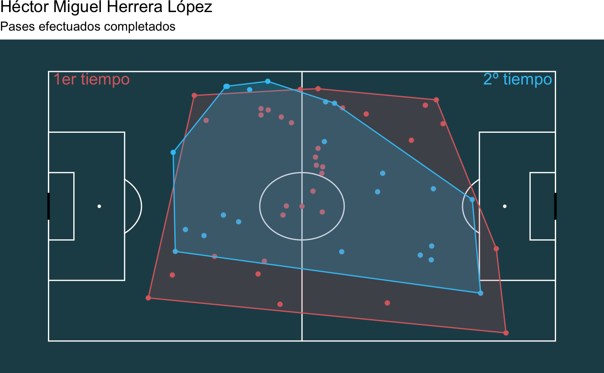
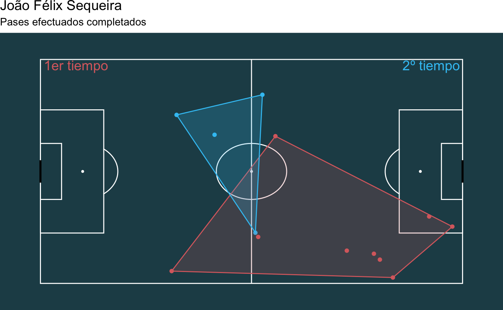
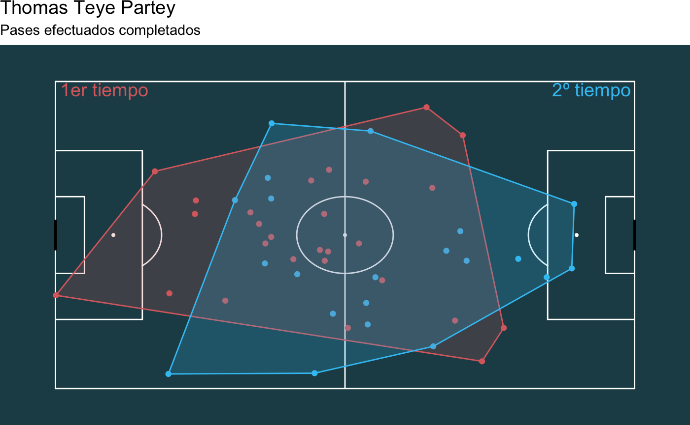
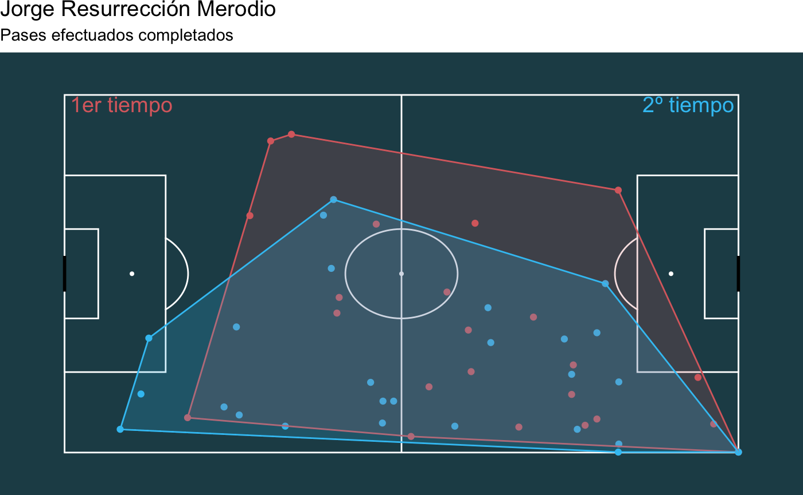
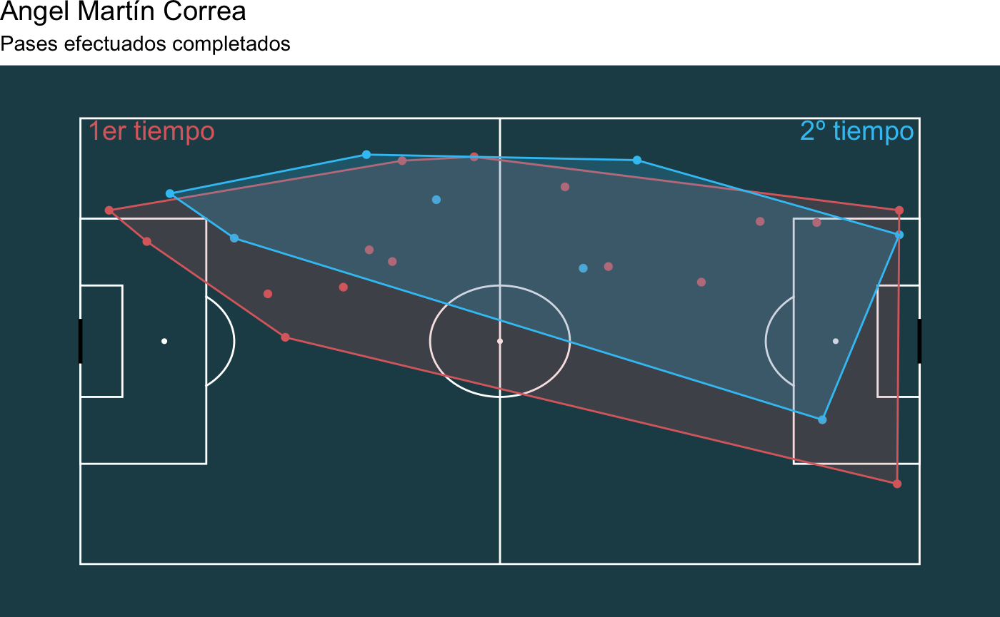
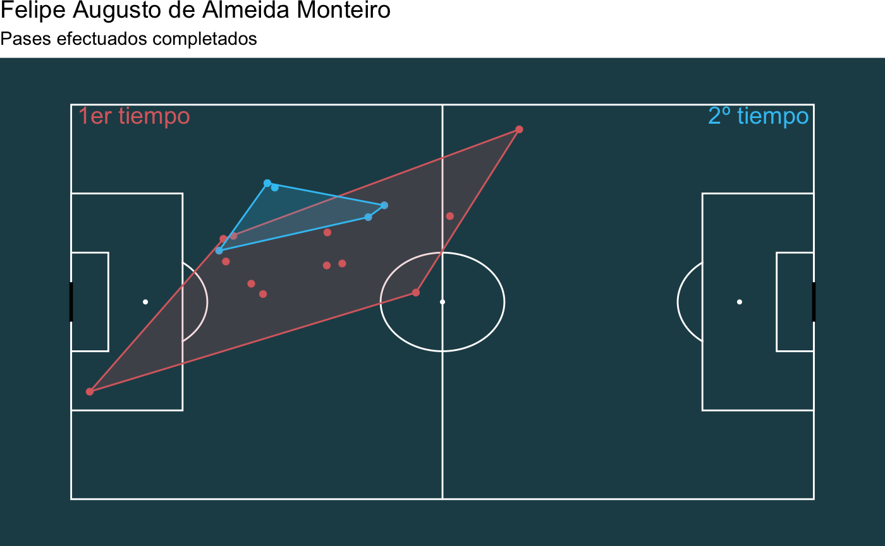
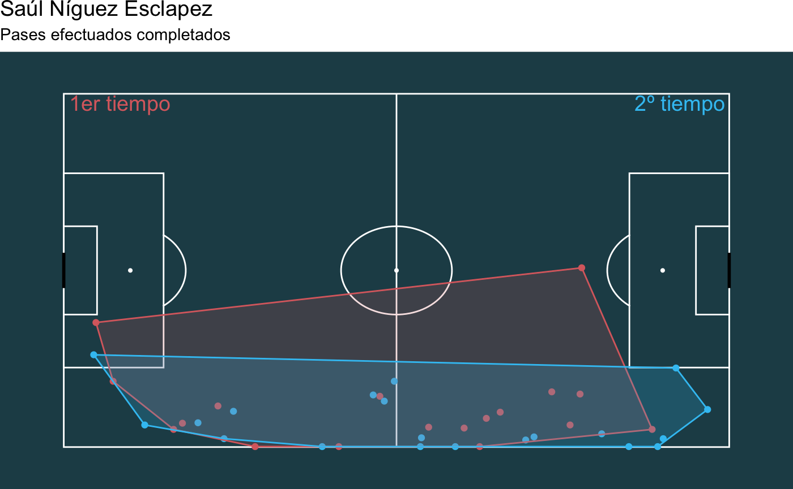
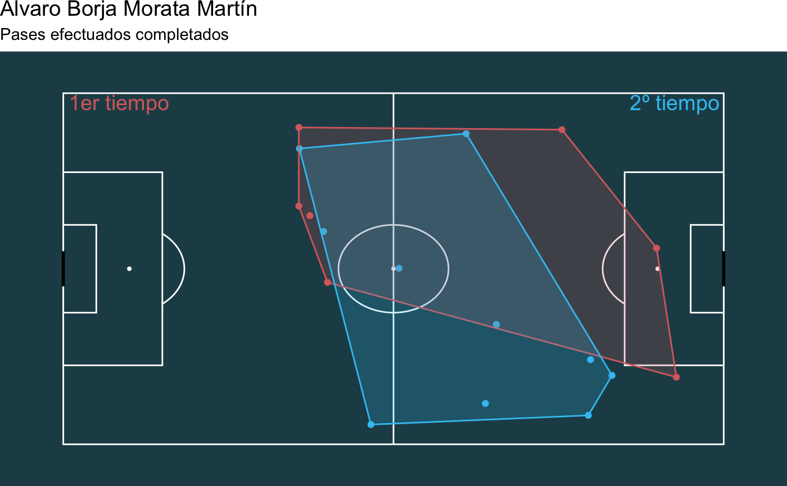

# Asignatura: Visualización de datos

## PRÁCTICA - Creación de la visualización y entrega del proyecto

<iframe title="v3 - Página 1" width="600" height="373.5" src="https://app.powerbi.com/view?r=eyJrIjoiOGZlZTM1MmEtNTRkMi00OWIzLWI1YzUtNDI3ZTg2OTMxYzk0IiwidCI6IjM1ZDdhY2Q4LTk3ZDMtNDkyZi1iZDViLTgxM2EwMzhjMGU1NiIsImMiOjl9" frameborder="0" allowFullScreen="true"></iframe>

## PEC2 - Estudio de técnicas de visualización de datos

### Ejemplo de Infografía:

<a href="https://infogram.com/c3bbdb86-631c-4fb8-b198-9d828549ba2b" style="color:#989898!important;text-decoration:none!important;" target="_blank">Ejemplo de Infografia</a> <a href="https://infogram.com" style="color:#989898!important;text-decoration:none!important;" target="_blank" rel="nofollow">Infogram</a>

### Ejemplo de Flow map:

<iframe width="700" height="600" src="https://flowmap.blue/1G2WaYSNepoMMGtzFAHAbIBBob88LShV-eWo-UoW0BX0/0db2dd9/embed?v=36.949927%2C-95.739228%2C3.08%2C0%2C0&a=1&as=1&b=1&bo=100&c=1&ca=1&d=0&fe=1&lt=1&lfm=ALL&t=20200320T050100%2C20200407T115800&col=Default&f=0" frameborder="0" allowfullscreen></iframe>

### Ejemplo de Convex Hull:

